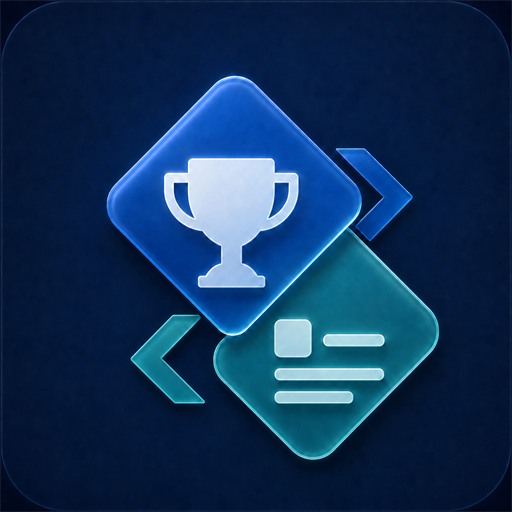

  

<h1 align="center">SATLI</h1>

  <strong>Steam 成就翻译管理器</strong> 
  Steam Achievement Translation &amp; Localization Integrator

  在 Windows 上获取、导入、编辑、安装、恢复和管理 Steam 成就翻译。

  
  
  

  <a href="https://apps.microsoft.com/detail/9PB7V9S03K80">⬇️ 从 Microsoft Store 获取</a>
  ·
  <a href="docs/USAGE.md">📖 使用指南</a>
  ·
  <a href="https://github.com/GaBoron/SATLI/issues/new/choose">💬 反馈问题</a>
  ·
  <a href="https://www.ifdian.net/a/gaboron">❤️ 赞助开发者</a>

## 下载与安装

> [!TIP]
> **推荐从 [Microsoft Store](https://apps.microsoft.com/detail/9PB7V9S03K80) 安装。** Microsoft Store 会负责安装并自动提供软件更新，应用设置页也支持主动检查 Store 新版、查看发布说明并打开更新页面。

Microsoft Store 的产品可用性可能因市场而异。产品页面在当前市场不可用、无法使用 Microsoft Store，或希望手动管理安装程序时，可从 [GitHub Releases](https://github.com/GaBoron/SATLI/releases/latest) 获取独立安装版。独立安装版通过应用内的 GitHub Releases 更新功能获取新版。

两个渠道提供相同的翻译管理功能并使用相同的数据格式，但不会相互安装对方的更新包。通常只需安装其中一个版本；切换渠道前请先退出并卸载当前版本。更多安装与更新说明见 [使用指南](docs/USAGE.md#安装与首次运行)。

## 快速开始

1. 打开应用，等待它扫描本机 Steam 游戏。
2. 在“可管理”页选择游戏和译本，预览目标语言与成就文本。
3. 点击“安装所选”，关闭 Steam，并确认管理员权限请求。

安装前，应用会校验译本并备份原文件。安装后可在“已管理”页检查状态、获取译本更新或恢复原文件。扫描、浏览和编辑草稿不需要管理员权限；只有安装、恢复或写回本地编辑等操作才会显示 UAC。

> [!TIP]
> 找不到游戏时，请先启动一次游戏，让 Steam 生成成就缓存，再返回应用重新扫描。

## 核心能力

| | 能力 | 说明 |
| --- | --- | --- |
| 🔎 | 自动发现 | 扫描 Steam 目录和本机成就缓存，支持按名称或 App ID 搜索 |
| 🛡️ | 安全安装 | 安装前预览与校验，自动备份，支持批量安装、状态检查和安全恢复 |
| ✍️ | 本地编辑 | 按成就编辑目标语言，自动保存草稿，并导出标准 BIN 或投稿 ZIP |
| ☁️ | 社区协作 | 获取社区译本、请求新翻译、贡献成果，并报告过期或无效文件 |
| 🌐 | 稳定连接 | 支持离线缓存、系统代理、HTTP/SOCKS 代理、自定义 DNS 与镜像 |

社区译本和本地导入使用同一套校验、备份与恢复流程。详细操作见 [使用指南](docs/USAGE.md)。

## 系统要求

- Windows 10 版本 2004（Build 19041）或更高版本，推荐 Windows 11
- x64 处理器
- 已安装 Steam；使用离线缓存时可暂时不联网

发布包已包含所需运行组件，无需另外安装 .NET、Windows App SDK 或 Python。

## 请求或贡献翻译

- **没有现成译本：** 在应用中点击“未找到游戏？”，导出原始 schema ZIP，并前往翻译库提交翻译请愿。
- **已经完成翻译：** 从编辑页导出标准投稿 ZIP，再通过翻译库的投稿入口提交。
- **希望使用 Codex 制作：** 打开 [Steam Achievement Localizer Skill](https://github.com/GaBoron/steam-achievement-localizer-skill)，完成翻译后将其 `final/` 目录导入管理器。

详细流程和文件要求见 [制作、导入与贡献翻译](docs/USAGE.md#制作导入与贡献翻译)。

## 项目生态

三个项目共同覆盖 Steam 成就译本的制作、分发和使用：

| 项目 | 定位 | 适合场景 |
| --- | --- | --- |
| **Steam 成就翻译管理器**（当前项目） | Windows 图形化客户端 | 查找、安装、编辑和恢复翻译 |
| [Steam 成就翻译库](https://github.com/GaBoron/steam-achievement-translation-library) | 社区翻译数据仓库 | 查找、请求、提交和维护译本 |
| [Steam Achievement Localizer Skill](https://github.com/GaBoron/steam-achievement-localizer-skill) | Codex 翻译与审核工作流 | 研究多语言语境并制作可验证译本 |

Localizer Skill 生成的标准 BIN/ZIP 可直接导入管理器，也可提交到翻译库供社区使用。偏好独立桌面编辑器时，可了解第三方项目 [SteamAchievementLocalizer](https://github.com/PanVena/SteamAchievementLocalizer)。

## 文档

| 文档 | 内容 |
| --- | --- |
| [使用指南](docs/USAGE.md) | 安装、编辑、恢复、投稿、网络设置与常见问题 |
| [数据与隐私](docs/PRIVACY.md) | 本地数据、凭据、日志和网络请求说明 |
| [第三方声明](THIRD_PARTY_NOTICES.md) | 随软件分发的第三方组件和权利说明 |

## 许可证

程序代码采用 [MIT License](LICENSE)。第三方组件和翻译数据的权利说明见 [第三方声明](THIRD_PARTY_NOTICES.md)。
